class: animated, fadeIn, middle
<!-- TODO Citação, add-on notas, trocar imagens -->

# O que esta oficina cobrirá?

1. Criação de conta no sistema online do [Zotero](http://www.zotero.org)
2. Instalação do plugin dentro do processador de textos
   * Google Docs, MS Word ou Libreoffice
3. Instalação de padrões de referência
4. Alimentação manual do banco de dados
4. Alimentação por ISBN ou por DOI
4. Criação de Bibliotecas e pastas
5. Citação automática e semi-automática
6. Preparação para envio
7. Inserção de anexos
8. Inserção de notas

Itens que **não serão cobertos nesta oficina**:
- Retirada automática de destaques de um PDF
---

class: middle, animated, fadeIn

```{r setup, include=FALSE}
 options(htmltools.dir.version = FALSE)
```
<style>
.center2 {
  margin: 0;
  position: absolute;
  top: 50%;
  left: 50%;
  -ms-transform: translate(-50%, -50%);
  transform: translate(-50%, -50%);
}
</style>
<style>
.pre2 {
    display: block;
    font-family: monospace;
    white-space: pre;
    margin: 3em 0px;
    margin-top: 0em;
    margin-right: 0px;
    margin-bottom: 0em;
    margin-left: 0px;
}
</style>

<style>
.font80 {
  font-size: 80%;
}
</style>

# Algumas noções preliminares

- Zotero é um programa de gerenciamento de bibliografia
   - Há diversos programas nessa área, alguns exemplos seriam:

| Programa                                           |  Gratuíto  |  Proprietário  |  Aberto  |
|----------------------------------------------------|:----------:|:--------------:|:--------:|
| [Zotero](http://www.zotero.org)                    |    Sim     |      Sim       |   Sim    |
| [Mendeley](https://en.wikipedia.org/wiki/Mendeley) |    Sim     |      Sim       |   Não    |
| [JabRef](https://en.wikipedia.org/wiki/JabRef)     |    Sim     |      Sim       |   Sim    |
| [EndNote](https://en.wikipedia.org/wiki/EndNote)   |    Não     |      Sim       |   Não    |
| [Papers](https://www.papersapp.com/)               |    Não     |      Sim       |   Não    |


---
class: middle, animated, fadeIn

# Algumas noções preliminares

- O que um gerenciador de bibliografia faz?
  - Organiza os dados bibliográficos em um banco de dados
  - Busca informações sobre as referências adicionada
  - Organiza bibliografias em documentos
    - Podem ser teses, dissertações, artigos
  - Permitem inserção de notas às referências coletadas
    - Fichamentos, citações diretas (recortes), extração de notas (via add on).
  - Conecta a referência ao seu arquivo de leitura

---
class: animated, fadeIn, middle
# A razão de nossa escolha!
## Porque o Zotero?
- É .RUred[código aberto]
- É .RUred[gratuíto]
- É .RUred[multiplataforma] (Widows, MacOS e Linux)
- É .RUred[multissítio]
  - Permite o uso via.RUred[ Web] ou.RUred[ stand alone] em diversos computadores

---
class: animated, fadeIn, middle
# Criação de uma conta Zotero

.center[Acessar [http://www.zotero.org](http://www.zotero.org)]

---
class: animated, fadeIn, middle

```{r fig03 ,echo=FALSE,fig.align='center'}

```
---
class: animated, fadeIn, middle

```{r fig04 ,echo=FALSE,fig.align='center'}
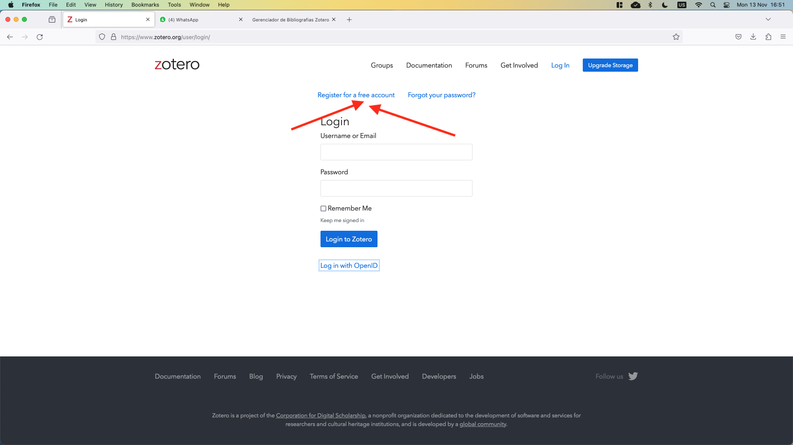
```
---
class: animated, fadeIn, middle

```{r fig05 ,echo=FALSE,fig.align='center'}

```
---
class: animated, fadeIn, middle
# Processadores de texto

- Microsoft Word e Zotero:
  - Instalação de plugin para o funcionamento da ferramenta

Settings (preferências) &rarr; Cite &rarr; Word Processors

- Google Docs
  - Necessária apenas autorização para utilização

Zotero &rarr; inserir citação &rarr; autorizar

---
class: animated, fadeIn, middle

```{r fig01 ,echo=FALSE,fig.align='center',out.width = "60%",out.width = "60%"}
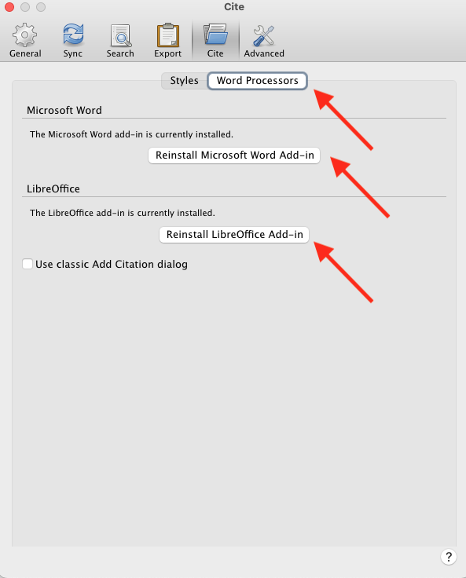
```
.center[Microsoft Word e Libreoffice]

---
class: animated, fadeIn, middle

```{r fig02 ,echo=FALSE,fig.align='center'}
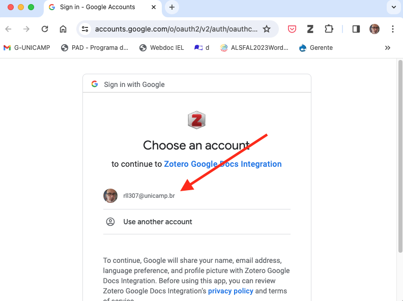
```

.center[Google Docs]


---
class: animated, fadeIn, middle
# Instalação de padrões de referência

Settings (preferências) &rarr; Cite &rarr; Styles

---
class: animated, fadeIn, middle


```{r fig06 ,echo=FALSE,fig.align='center',out.width = "600px",out.width = "70%"}
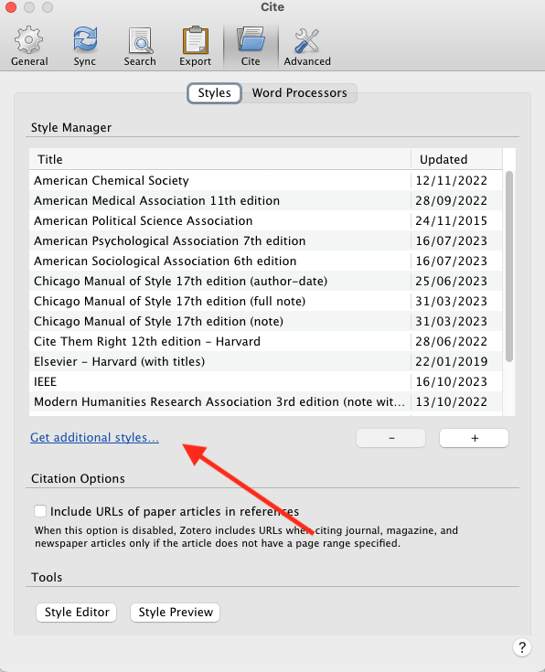
```


---
class: animated, fadeIn, middle


```{r fig07 ,echo=FALSE,fig.align='center'}
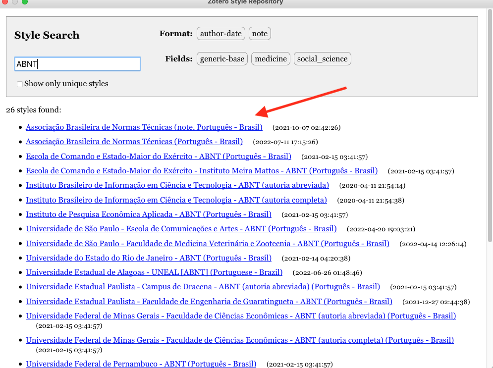
```
---
class: animated, fadeIn, middle
```{r fig08 ,echo=FALSE,fig.align='center',out.width = "70%",out.width = "70%"}
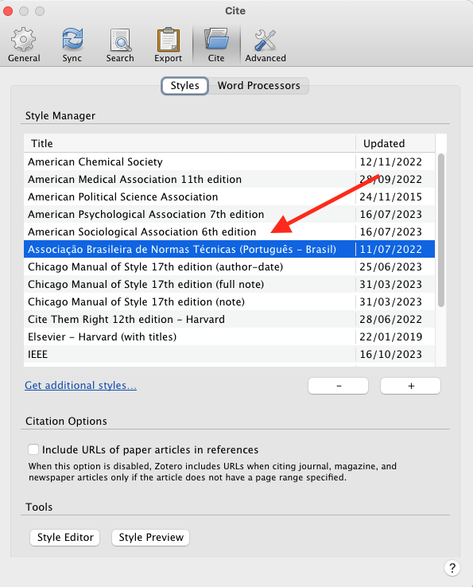
```

---
class: animated, fadeIn, middle
# Outras configurações importantes

* Determinar o diretório base para o material bibliográfico
* Conectar sua conta pessoal no Zotero
* Gerenciar a sincronia de dados

---
class: animated, fadeIn, middle
```{r fig09 ,echo=FALSE,fig.align='center',out.width = "70%",out.width = "70%"}
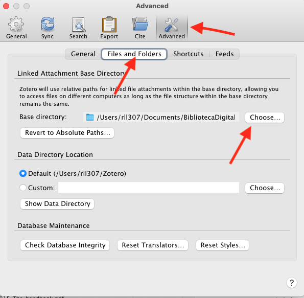
```

---
class: animated, fadeIn, middle
```{r fig011 ,echo=FALSE,fig.align='center',out.width = "70%",out.width = "70%"}
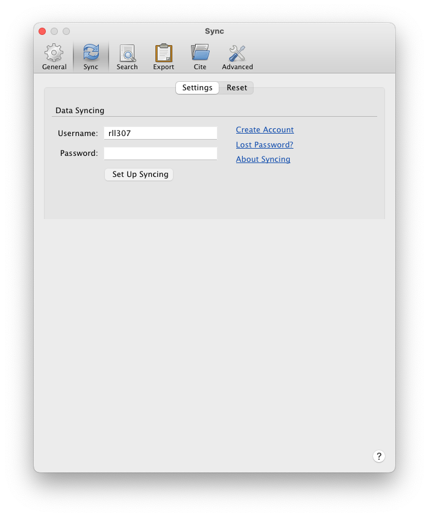
```

---
class: animated, fadeIn, middle
```{r fig012 ,echo=FALSE,fig.align='center',out.width = "70%",out.width = "70%"}
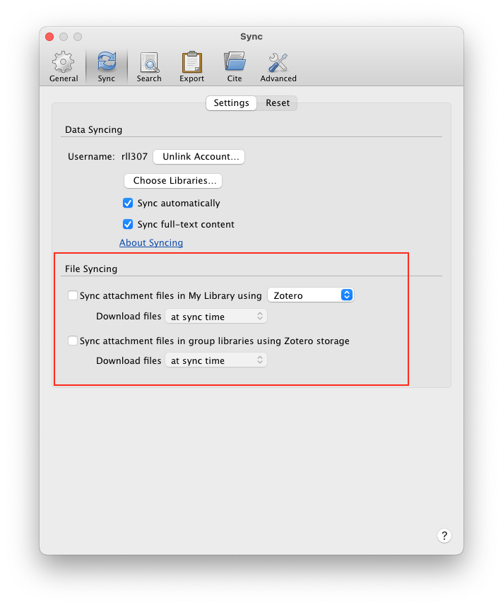
```

---
class: animated, fadeIn, middle
# Inserindo dados manualmente

Acessar [https://periodicos.ufsc.br/index.php/textodigital/article/view/92469](https://periodicos.ufsc.br/index.php/textodigital/article/view/92469)

```{r fig013 ,echo=FALSE,fig.align='center',out.width = "70%",out.width = "70%"}
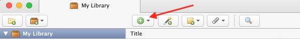
```


2. Observar os detalhes do artigo
2. Identificar informações relevantes
   - Autor
   - Título
   - Revista
   - Edição
   - Volume
   - Páginas
   - Link
   - DOI
3. Copiar os dados para o programa
Contudo, vale ressaltar que alguns dados precisarão ser .RUred[verificados]
---
class: animated, fadeIn, middle

Colando na plataforma
```{r fig014 ,echo=FALSE,fig.align='center',out.width = "150%",out.width = "150%"}
knitr::include_graphics('./images/Inserir02.png')
```

---
class: animated, fadeIn, middle
# Inserindo pelo número de indexação

Selecione o número e o coloque no campo indicado na barra

```{r fig015 ,echo=FALSE,fig.align='center'}
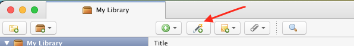
```
---
class: animated, fadeIn, middle
```{r fig016 ,echo=FALSE,fig.align='center'}
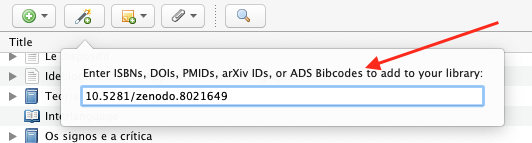
```

---
class: animated, fadeIn, middle
# Inserção utilizando o navegador

O Zotero consegue adicionar automaticamente os metadados de sites como:
- Revistas acadêmicas
  - Utilizando metadados ou sistemas de adm de submissão
- Google Citações
- Amazon (livros)

Contudo, vale ressaltar que alguns dados precisarão ser .RUred[verificados]

---
class: animated, fadeIn, middle
```{r fig017 ,echo=FALSE,fig.align='center'}

```


<hr style="border:2px solid gray">

```{r fig018 ,echo=FALSE,fig.align='center'}
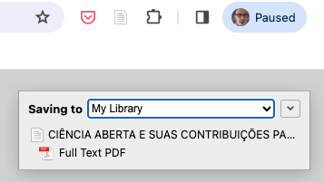
```


---
class: animated, fadeIn, middle
# Inserindo citações em Modo Automático

.center[Libreoffice]
<video controls>
  <source src="./images/V01.mov">
</video>


---
class: animated, fadeIn, middle
.center[Google Docs]

<video controls>
  <source src="./images/V02.mov">
</video>

---
class: animated, fadeIn, middle
# Mudando o padrão das referências
Válido apenas em .RUred[Modo Automático]

<video controls>
  <source src="./images/V03.mov">
</video>

---
class: animated, fadeIn, middle

# Preparando o arquivo para o envio
**Importante**: É necessário excluir os códigos do arquivo antes de enviar para a revista.

1. Clique em *Salvar Como*
2. Salve uma cópia de seu arquivo
   - Isso preservará seu original
3. Clique no botão da barra do Zotero com um "elo quebrado"
4. O arquivo está sem códigos.
   - Não pode mais ser editado pelo zotero.
      - Isso deixa o arquivo pronto para o envio
<br />  <br />
```{r fig019 ,echo=FALSE,fig.align='center'}
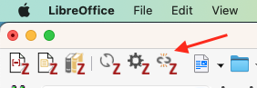
```
---
class: animated, fadeIn, middle
# Modo Manual

1. Criar uma pasta na biblioteca do Zotero
2. Arrastar as referências que farão parte do artigo para a pasta
    - Minha biblioteca não será alterada
3. Selecionar a citação individual que deseja colocar no documento
    - Colar a citação no documento
       - Repetir para cada citação em cada caso
4. Após o termino do artigo
    - Selecionar todas as referências da pasta
    - Gerar bibliografia
    - Colar a bibliografia no documento

---
class: animated, fadeIn, middle

<video controls>
  <source src="./images/V04.mov">
</video>

---
class: animated, fadeIn, middle
# Adcionando notas a uma bibliografia
- As notas acompanham a bibliografia e podem ser utilizadas para fichamentos.

<video controls>
  <source src="./images/V05.mov">
</video>

---
class: animated, fadeIn, middle
# Inserindo anexos a uma entrada sem arquivo
```{r fig020 ,echo=FALSE,fig.align='center'}
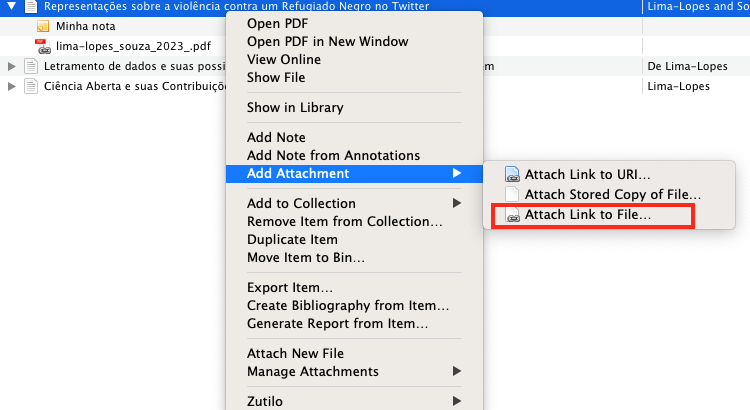
```
---
class: inverse, animated, fadeIn, middle
.center[
## Obrigado!


.RUred[Rodrigo Esteves de Lima-Lopes]


[rll307@unicamp.br](mailto:rll307@unicamp.br)

[https://github.com/rll307/](https://github.com/rll307/)
]


```{r fig10 ,echo=FALSE,fig.align='center', out.width = "70%"}

```


